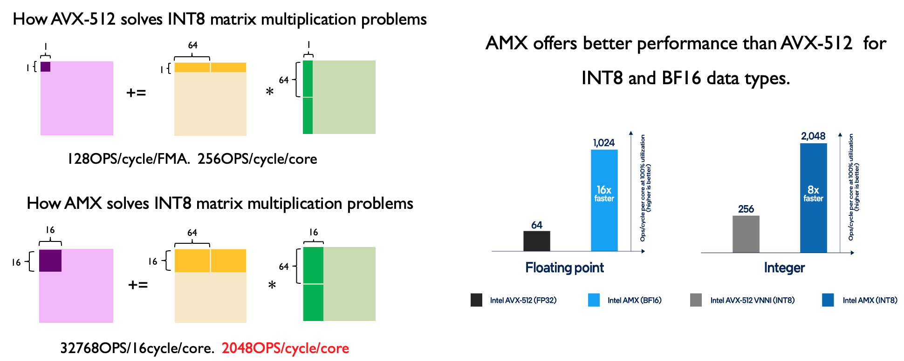
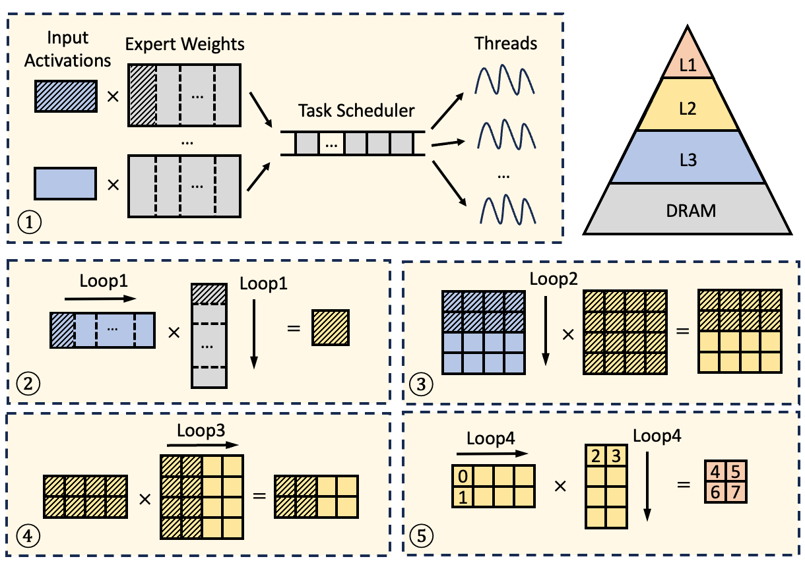
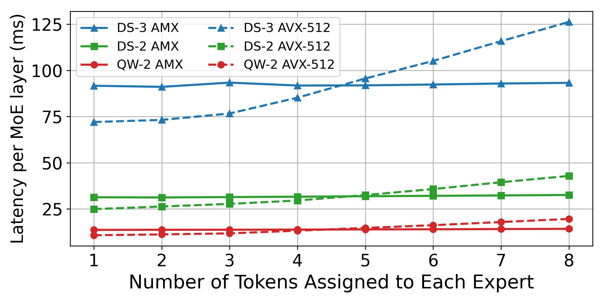
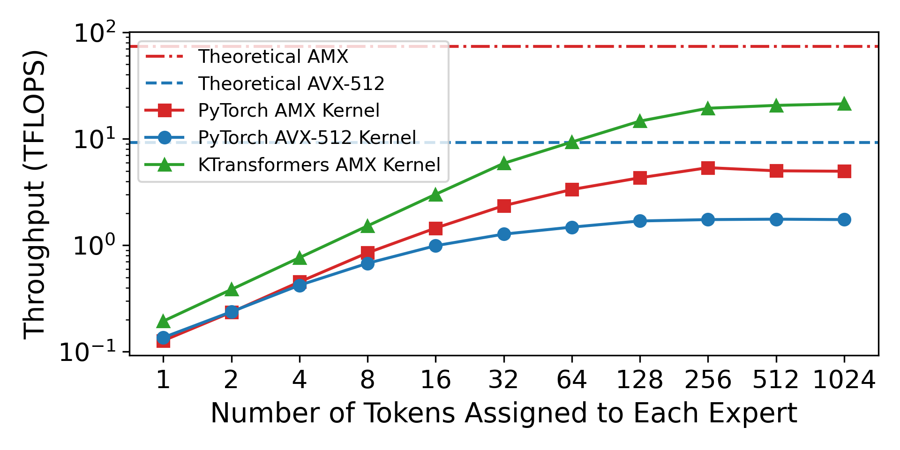

# Qwen 3 + KTransformers 0.3 (+AMX) = AI工作站/个人电脑

继DeepSeek-V3/R1、LLaMa-4和Kimi-VL之后，Qwen也发布了一款令人印象深刻的MoE模型——毫无疑问，今年是MoE的天下。作为一个在本地异构环境中低门槛运行MoE模型的推理系统，KTransformers自然加入了这场盛宴。在Qwen团队的支持下，我们完成了对整个Qwen 3系列MoE模型的首日支持。同时，我们借此机会开源了期待已久的AMX高性能算子初步版本（BF16、Int8；Int4变体即将推出），正式升级至0.3版本。

Qwen3MoE最让我兴奋的是，与671B的"巨型"模型不同，它的两种配置：235B-A22和30B-A3B，**恰好命中了本地工作站和消费级PC的性能甜点**。相应地，我们在两种典型设置中进行了基准测试：

服务器CPU（Xeon 4）+ RTX 4090

消费级CPU（酷睿i9-14900KF + 双通道DDR5-4000 MT/s）+ RTX 4090

注意：由于PC内存频率低、容量大且有多根内存条，导致严重降频，仅以4000MT运行。使用更高频率的内存可以提升性能。

结果如下：

https://github.com/user-attachments/assets/fafe8aec-4e22-49a8-8553-59fb5c6b00a2


可以看到，得益于AMX指令优化，我们在工作站场景下实现了高达347 tokens/s的预填充性能。在消费级CPU上，我们能够运行大型模型（235B-A22）并在较小的30B-A3B上提供流畅性能。即使从资源开销来看，高端游戏笔记本也可以流畅处理30B-A3B。在谈论了如此之久的AIPC概念后，我们终于能够看到其可行性。

以下是Qwen3MoE的启动命令：

``` python
# llamafile后端
python ktransformers/server/main.py --architectures Qwen3MoeForCausalLM --model_path <model_dir> --gguf_path <gguf_dir> --optimize_config_path ktransformers/optimize/optimize_rules/Qwen3Moe-serve.yaml --backend_type balance_serve
# AMX后端
python ktransformers/server/main.py --architectures Qwen3MoeForCausalLM --model_path <model_dir> --gguf_path <gguf_dir> --optimize_config_path ktransformers/optimize/optimize_rules/Qwen3Moe-serve-amx.yaml --backend_type balance_serve
```

**注意：目前，使用AMX运行Qwen3MoE只能读取BF16 GGUF；后续将添加从safetensor加载的支持。**

为了便于大家理解我们开源的AMX优化，我们准备了一份简要文档。我们也向Intel表示感谢，感谢他们的帮助。

# AMX指令集介绍

Intel高级矩阵扩展（Advanced Matrix Extensions，简称AMX）是一组为x86架构引入的专门指令扩展，从Sapphire Rapids（第四代至强可扩展处理器）开始引入。AMX在硬件层面加速大规模矩阵计算，特别是深度学习推理和机器学习工作负载中计算密集型部分。通过引入Tile寄存器的概念，它将2D子矩阵加载到专用Tile寄存器中，并在寄存器级别执行矩阵乘累加操作，显著提高吞吐量和能效。

每个CPU核心包含8个专用寄存器（tmm0–tmm7），每个寄存器最多可存储16行×64字节的数据，用于存储2D子矩阵。此外，还有一个64字节的配置寄存器（TILECFG），用于描述每个tmm寄存器的行数、列数和行步长。

主要AMX指令总结如下：

| 指令类别 | 指令名称 | 描述 |
|:---|:---|:---|
| 配置指令 | LDTILECFG, STTILECFG, TILERELEASE, TILEZERO | 配置/重置Tile寄存器和元数据 |
| 加载/存储指令 | TILELOADD, TILELOADDT1, TILESTORED | 在内存和Tile寄存器之间传输数据 |
| INT8计算指令 | TDPBSSD, TDPBUSD, TDPBUUD, TDPBSUD | 对Tile内的int8子矩阵执行乘加操作 |
| BF16计算指令 | TDPBF16PS | 对Tile内的bfloat16子矩阵执行乘加操作 |

为了简化开发，Intel提供了相应的内联函数，使C/C++开发者能够利用AMX的性能优势，而无需编写冗长的汇编代码。例如：

```C++
#include <immintrin.h>

_tile_loadconfig(cfg_ptr);
_tile_loadd(tmm0, A_ptr, lda);
_tile_loadd(tmm1, B_ptr, ldb);
_tile_zero(tmm2)
_tile_dpbf16ps(tmm2, tmm0, tmm1);
_tile_stored(tmm2, C_ptr, ldc);
_tile_release();
```

上面的代码将子矩阵从内存（A_ptr、B_ptr）复制到Tile寄存器，调用AMX BF16计算指令乘以两个子矩阵，然后将结果复制到内存（C_ptr）。

以INT8为例，AMX可以用单条指令在16个CPU周期内执行两个16×64子矩阵（32,768个乘/加操作）的乘法，使每个核心每周期完成2048个乘/加操作——是AVX-512的8倍性能。在Intel Xeon 4 CPU上，单个核心理论上可以提供4 TOPS的计算能力，非常适合CPU上的计算密集型任务。

<p align="center">
  <picture>
    
  </picture>
</p>


# KTransformers中的AMX内核

在v0.3版本之前，KTransformers基于llamafile提供的算子执行CPU矩阵乘法。遗憾的是，llamafile的实现尚未针对AMX指令集进行优化。这导致在强大的硬件环境（如Xeon 4代 + 4090）中也存在性能瓶颈，大型模型如DeepSeek-V3在预填充阶段的推理速度仅达到91 tokens/s。CPU因此仍然是一个显著的瓶颈。在长提示场景下，这样的性能显然不尽如人意。为了充分释放CPU潜力，我们在v0.3中引入了全新的AMX优化路径以及多项技术改进。

## 1. AMX Tiling感知内存布局

AMX提供了高吞吐Tile寄存器计算模型，通过粗粒度矩阵操作减少指令数量并提高理论吞吐量。然而，要真正发挥AMX的潜力，内存访问效率至关重要：因为AMX一次传输整个Tile，未对齐的Tile和混乱的访问模式会导致严重的缓存未命中，从而抵消吞吐量增益。

因此，在v0.3中，我们停止直接内存映射GGUF格式文件，并在模型加载过程中引入了AMX Tiling感知内存预处理。具体而言，MoE模型中的专家权重矩阵被预先重新排列为Tile友好的子矩阵，其形状精确匹配AMX Tile寄存器尺寸，消除了推理过程中的动态转置开销。在重排过程中，我们严格将每个子矩阵的起始地址对齐到64字节，以避免缓存行分裂，并根据计算访问模式顺序排列子矩阵，利用编译器和硬件顺序预取功能最大化L1/L2缓存命中率。

对于Int8量化格式，我们采用了对称组量化，每列形成一个组，共享一个单独存储的尺度因子，以维持Tile数据的内存对齐。

这种AMX Tiling感知内存布局设计减少了内存延迟，同时为下游计算内核提供了最佳输入条件。

## 2. 缓存友好的AMX内核

在推理过程中，我们围绕CPU的多级缓存层次结构进行设计，在高速缓存中就地执行计算，最小化DRAM访问频率和开销。

<p align="center">
  <picture>
    
  </picture>
</p>

如图所示，
- ① 专家权重矩阵首先按列划分为多个任务，动态调度到各线程。输入激活在任务间共享，由于局部性通常驻留在共享L3缓存中。
- ② 在每个任务内，专家权重按行划分为块，块大小经过精细调整，确保输入激活、权重和中间结果保持在L2缓存内，避免DRAM访问。
- ③ ④ ⑤ 每个块被视为一组匹配AMX Tile寄存器的子矩阵，在Tile级计算期间，输入Tile（tmm0–tmm1）和专家Tile（tmm2–tmm3）被加载，四个AMX乘法指令直接在Tile寄存器（tmm4–tmm7）中生成并累积乘积，输出激活在Tile寄存器或L1缓存中累积，避免额外的数据移动。

简而言之，我们利用缓存层次结构：专家权重和输出激活的每个数据元素只访问DRAM一次，其他访问命中L2或更高级缓存；输入激活只从DRAM访问一次，之后在L3或更高级缓存中命中。这显著减少了主内存流量并提高了整体执行效率。

## 3. 低算术强度场景的AVX-512内核适配

尽管AMX对大规模矩阵乘法非常高效，但在低算术强度下表现不佳，如解码阶段的向量矩阵操作。这是因为调度AMX Tile涉及固定指令开销，当数据量不足以填充Tile时，这种开销会造成浪费，导致吞吐量降低。

<p align="center">
  <picture>
    
  </picture>
</p>

为解决这个问题，我们引入了轻量级AVX-512内核作为补充。该内核遵循与AMX内核相同的内存布局，但用细粒度AVX-512向量矩阵乘法替代重型AMX矩阵矩阵乘法，降低小矩阵的延迟。

KTransformers根据算术强度在运行时动态选择AMX和AVX-512内核：AMX内核在长提示预填充阶段自动选择（每个专家平均处理超过4个token），而短提示预填充和解码阶段动态切换到AVX-512内核。这确保了在不同算术强度条件下的最佳效率。

## 4. MoE算子融合和动态调度

MoE模型每层有多个专家，每个专家需要三次矩阵乘法（Gate、Up、Down投影），导致许多小型矩阵乘法任务。独立调度每个小任务会导致线程间大量同步开销，拖慢整体推理速度。

因此，我们将同一层中所有专家的同类型矩阵计算融合为大型统一任务。此外，由于Gate和Up投影之间没有数据依赖，它们的计算也可以融合，最终将一层的矩阵乘法合并为两个主要任务，大大减少调度开销。

为解决负载不平衡——尤其是在预填充阶段，专家激活可能高度倾斜——我们引入了动态任务调度策略。每个矩阵乘法任务进一步分为多个细粒度子任务，最初均匀分布在CPU线程中。一旦线程完成其分配的任务，它就会原子地从其他线程"窃取"任务，极大地缓解负载不平衡，实现接近最优的CPU资源利用率。

得益于这些优化，我们的内核在Xeon4 CPU上能够实现21 TFLOPS的BF16吞吐量和35 TOPS的Int8吞吐量——约为PyTorch通用AMX内核的4倍。对于DeepSeek-V3，将Xeon4 CPU与单个RTX 4090 GPU配对可实现418 tokens/s的端到端吞吐量，接近多机多GPU设置的性能。KTransformers的AMX内核是第一个专为MoE推理场景设计的AMX内核，显著降低了大型模型部署的硬件门槛，使更多开发者能以更低成本享受GPU集群级推理体验。

<p align="center">
  <picture>
    
  </picture>
</p>

# 使用方法

## 检查AMX支持

在启用AMX优化内核之前，重要的是验证您的CPU是否支持AMX指令集。您可以使用以下命令检查AMX可用性：

```bash
lscpu | grep -i amx
```

如果您的系统支持AMX，您应该会看到类似于以下的输出：

```bash
Flags: ... amx-bf16 amx-int8 amx-tile ...
```

如果没有找到amx相关标志，您的CPU可能不支持AMX，或者AMX可能在BIOS设置中被禁用。在这种情况下，请确保：
- 您使用的是Sapphire Rapids（至强第四代）或更新的CPU。
- 在系统BIOS的CPU功能设置中启用了AMX支持。

## 在KTransformers中启用AMX

KTransformers允许用户通过简单的YAML配置修改轻松切换不同后端。要启用AMX，请修改专家的注入配置，将后端指定为AMXInt8或AMXBF16：

```YAML
- match:
    name: "^model\\.layers\\..*\\.mlp\\.experts$"
  replace:
    class: ktransformers.operators.experts.KTransformersExperts    # 具有专家并行性的自定义MoE内核
    kwargs:
      prefill_device: "cuda"
      prefill_op: "KExpertsTorch"
      generate_device: "cpu"
      generate_op: "KExpertsCPU"
      out_device: "cuda"
      backend: "AMXInt8"  # 或 "AMXBF16" 或 "llamafile"（默认）
```

**注意：** 目前，使用AMXInt8需要从BF16 GGUF文件读取权重并在模型加载期间执行在线量化。这可能导致加载时间略长。未来版本将提供预量化权重，以消除这一开销。

 