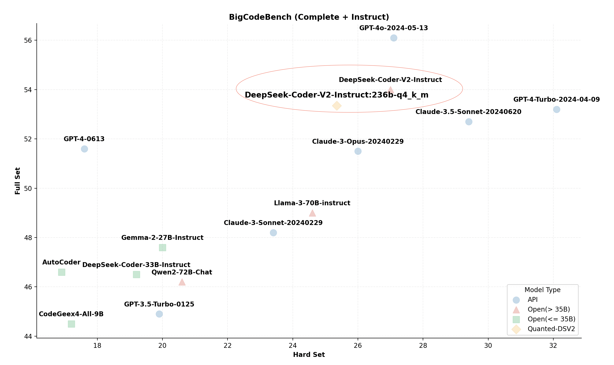
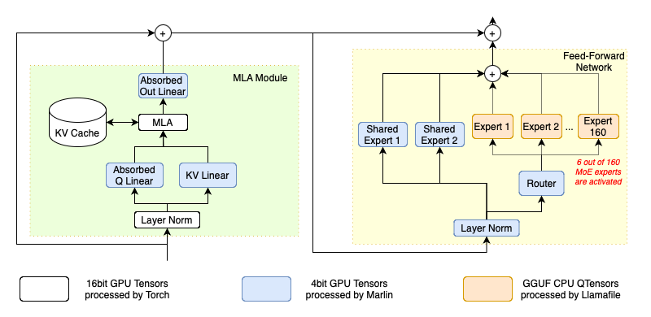

# 教程：异构和本地 MoE 推理

DeepSeek-(Code)-V2 是一系列强大的混合专家模型（MoE），总共拥有 2360 亿参数，每个标记激活 210 亿参数。该模型在各种基准测试中展示了卓越的推理能力，使其成为最先进的开源模型之一，其性能几乎可与 GPT-4 相媲美。DeepSeek-R1 使用与 DeepSeek-V2 类似的架构，但参数数量更多。

<p align="center">
  <picture>
    
  </picture>
</p>

此外，与之前使用传统注意力机制（如分组查询注意力，GQA）的模型不同，DeepSeek-V2 采用了一种新型的多头潜在注意力（MLA）。这一创新显著减少了推理过程中所需的 KV 缓存大小，提高了效率。

然而，尽管其效率很高，在个人计算设备上运行如此大型的模型似乎并不实际。DeepSeek-V2 的官方文档指出，标准推理操作需要八个 80GB 的 GPU，即使是缩小版的 Q4_k_m 版本也至少需要两个 80GB 的 GPU。这些要求超出了大多数个人研究者和小团队的能力范围。

尽管如此，通过采用几种前沿优化技术，我们成功地在一台仅有 21GB VRAM 和 136GB DRAM 的台式计算机上运行了这个庞大的模型。在本文档中，我们概述了所使用的具体优化措施，并提供了关于如何使用 KTransformers 实施这些策略的详细教程。

## 应用的优化

### 优化的 MLA 操作符

下图简要概述了 DeepSeek-V2 的架构。在其注意力层的核心，DeepSeek-V2 引入了一种新型的 MLA 操作符，它使用一种共同的、联合压缩表示来表示键值对的头部，这对效率提升具有重要潜力。然而，MLA 操作符的官方开源实现明确地解压缩了这种压缩表示，并缓存解压缩后的键值对。这个过程不仅增大了 KV 缓存的大小，还降低了推理性能。

<p align="center">
  <picture>
    
  </picture>
</p>

为了真正利用 MLA 的优势，我们为推理实现了一个优化版本。根据其原始论文，我们将解压缩矩阵直接吸收到 q_proj 和 out_proj 权重中。因此，在计算注意力时不需要解压缩压缩表示。这一调整显著减少了 KV 缓存的大小，并增加了该操作符的算术强度，极大地优化了 GPU 计算能力的利用率。

### 高级量化内核

原始的 DeepSeek-V2 模型以 BF16 格式存储其参数，消耗大约 470GB 的原始存储空间。这超出了主流台式计算机可用的 RAM 容量。为了解决这个问题，我们利用了已建立的 GGUF 社区的量化权重，简化了用户的使用过程。
然而，高度优化的 BLAS 包通常不支持量化数据类型。因此，原始的 HuggingFace Transformers 的 Torch 实现必须在处理前将这些张量反量化为支持的数据类型，这带来了不必要的计算开销并增加了内存流量。为了克服这一点，我们整合了可直接对量化数据类型进行操作的高级内核，从而优化了推理性能。

在 KTransformers 的当前版本中，我们使用 Marlin 作为 GPU 内核，使用 llamafile 作为 CPU 内核。这些内核专门设计以受益于现代 GPU 架构和现代 CPU 指令扩展，如 AVX512-BF16（AMD Zen4 或更新版本）和 AVX-VNNI（Intel Alder Lake 或更新版本），这些都是为量化数据类型和机器学习工作负载量身定制的。我们还在 CPU 上基于 llamafile 使用专家并行和其他 MOE 推理优化，并将它们称为 CPUInfer。如图 2（引用自 Marlin）所示，与相应的 Torch 对应物相比，Marlin 可以实现接近理想的 3.87 倍加速。如下图所示，我们的微基准测试表明，使用 CPUInfer 的推理比在低位表示中使用 Torch 快数倍。请注意，在实际推理中，如使用 transformers，Torch 基准使用 BF16 或 FP16 作为线性权重，并将占用更多内存资源，或者当使用量化权重时，由于反量化会更慢。

<p align="center">
  <picture>
    
  </picture>
</p>
<p align="center">
  <picture>
    
  </picture>
</p>

### 算术强度引导的卸载

对于本地用户而言，在 GPU VRAM 中存储模型的所有 2360 亿参数显然是不切实际的。因此，我们战略性地只将计算强度最高的参数存储在 GPU 上。例如，经过我们的优化，具有共享压缩键值表示的 128 个头的 MLA 操作符显示出 512 的算术强度。这使其成为最密集的操作符，特别是在较小的推理批量大小下。因此，它被分配到 GPU 上以利用张量核心的能力。

另一方面，如图 1 所示，DeepSeek-V2 中的每个 transformer 块包括 160 个混合专家（MoE），占总参数的 96%。然而，MoE 路由器在每个标记中仅激活这 160 个专家中的 6 个，这意味着在解码阶段仅使用了 3.75% 的 MoE 参数。在批量大小为 1 的情况下，MoE 操作的算术强度大约为 0.075。这种主要涉及批量通用矩阵-向量乘法（GEMV）的操作因此可以由 CPU 高效处理。

按照将所有操作符按其算术强度排列并尽可能将最密集的放在 GPU 中的原则，我们优先将 MoE 参数和词嵌入计算放在 CPU 端以利用其更大的内存容量。同时，其余参数，包括共享专家、注意力模块中的投影和 MLA，存储在 GPU VRAM 中。由于这些参数由每个标记访问，它们在 GPU 上的放置最大限度地利用了高内存带宽的优势。这种配置导致如果使用 Q4_K_M 版本，约 20.7 GB 的 VRAM 使用量和 136GB DRAM 内存请求，这在本地台式机上是可行的。此外，可以根据实际配置调整放置，遵循相同的原则。

此外，作为一个可扩展的框架，KTransformers 将在未来版本中支持更多高级操作符，持续增强其高效处理各种工作负载的能力。

## YAML 模板

要在 KTransformers 中实现上述优化，用户需要编写一个包含优化规则的 YAML 文件。
KTransformers 将遍历模型的所有子模块，匹配 YAML 规则文件中指定的规则，并按照指定将它们替换为高级模块。

<p align="center">
  <picture>
    
  </picture>
</p>

具体来说，使用以下规则：

- 用我们[优化的 MLA 操作符](#mla)替换注意力模块。
- 用使用 Llamafile 的 [CPUInfer 内核](#experts)替换路由专家。
- 用 [Marlin](#linear) 内核替换所有不属于注意力的线性模块。


<h3 id="mla">MLA</h3>

对于注意力模块注入，我们只需要使用正则表达式匹配 Transformers 中使用的模块名称，并用我们预先实现的模块替换它。
下面列出了 YAML 规则。

```yaml
- match:
    name: "^model\\.layers\\..*\\.self_attn$" # 正则表达式
  replace:
    class: ktransformers.operators.attention.KDeepseekV2Attention # 优化的 MLA 实现
```

如我们所见，YAML 文件中的每条规则都有两个部分：`match` 和 `replace`。
match 部分指定应该替换哪个模块，replace 部分指定要注入到模型中的模块以及初始化关键字。

<h3 id="experts">路由专家</h3>

对于路由专家，我们注入的模块是 CPUInfer 的包装器，KTransformersExperts。一个包装器内有几种实现，我们需要指定关键字来告诉包装器我们想要使用哪种实现以及我们打算如何使用它。

在 KTransformers 中，一些模型在预填充和生成期间表现不同以获得更好的性能。KTransformersExperts 就是其中之一。所有这些特殊模块都有一个 `device` 关键字，描述模块应该在哪个设备上初始化。其他关键字指定预填充和生成期间的行为，在使用不同的注入模块时可能会有所不同。在这里，我们指定在预填充和生成期间我们想要在哪个设备上使用哪种实现，以及输出应该在哪个设备上。
请注意，我们只在启用分层预填充时使用这些参数；否则，预填充将以与生成相同的配置进行。

在 Transformers 的原始实现中，MoE 是使用 `nn.ModuleList` 实现的。我们不希望 KTransformers 遍历列表中的所有子模块，所以我们在这个规则中设置 `recursive: False` 以防止递归注入到当前模块的子模块中。以下是 YAML 规则：

```yaml
- match:
    name: "^model\\.layers\\..*\\.mlp\\.experts$"
  replace:
    class: ktransformers.operators.experts.KTransformersExperts     # 具有专家并行性的自定义 MoE 内核
    device: "cpu"   # 初始化时加载此模块的设备
    kwargs:
      prefill_device: "cuda"
      prefill_op: "KExpertsTorch"
      generate_device: "cpu"
      generate_op:  "KExpertsCPU"
      out_device: "cuda"
  recursive: False # 不递归注入此模块的子模块
```

如果我们将专家列表注入为自定义模块，我们无法默认使用 `nn.ModuleList` 中的接口。我们需要更改 FFN 模块中的前向函数。最简单的方法是使用自定义前向函数实现一个新模块并注入它。我们已经实现了新模块，注入可以通过简单地添加一个注入规则来完成。我们可以使用 `class` 而不是 `name` 来匹配将被替换的模块。以下是 YAML 规则：

```yaml
- match:
    class: ktransformers.models.modeling_deepseek.DeepseekV2MoE
  replace:
    class: ktransformers.operators.experts.KDeepseekV2MoE     # 具有自定义前向函数的 MLP 模块
```

<h3 id="linear">其他线性模块</h3>

对于剩余的线性模块，我们想使用我们的量化内核。然而，我们不想在 MLA 操作符中注入线性，因为我们目前不知道在 MLA 中使用量化的效果。
所以，我们可以更改我们的正则表达式并在规则的 match 部分添加一个类检查。只有同时匹配名称和类的模块才会被注入。
我们还需要传递类似于专家注入的一些关键字。以下是 YAML 规则：

```yaml
- match:
    name: "^model\\.layers\\.(?!.*self_attn).*$"  # 正则表达式 
    class: torch.nn.Linear  # 只匹配同时匹配名称和类的模块
  replace:
    class: ktransformers.operators.linear.KTransformersLinear  # 量化数据类型上的优化内核
    kwargs:
      generate_device: "cuda"
      prefill_device: "cuda"
      generate_op: "KLinearMarlin"
      prefill_op: "KLinearTorch"
```

<h3 id="Pre-compute Buffers">预计算缓冲区</h3>

原始模型在元设备上初始化。旋转位置嵌入模块在初始化时预计算一些缓冲区，但在使用元设备时没有效果，不计算任何内容。因此，我们需要在加载模型时计算缓冲区。为方便起见，我们使用自定义模块注入旋转位置嵌入模块，该模块在加载时执行预计算。以下是 YAML 规则：

```yaml
- match:
    class: ktransformers.models.modeling_deepseek.DeepseekV2YarnRotaryEmbedding
  replace:
    class: ktransformers.operators.RoPE.YarnRotaryEmbedding
```

## 包装您的自定义模块

我们已经实现了一些模块，但您可能需要使用 KTransformers 注入您的自定义模块。
您唯一需要做的就是包装您的自定义模块并编写 YAML 文件。我们提供了一个基本操作符，指定注入模块应该具有的接口。您只需要从该模块继承并根据需要更改 `__init__`、`forward` 或 `load` 函数。

- 基本操作符的 `__init__` 函数维护了 KTransformers 框架注入和执行所需的必要信息。要覆盖此函数，子类模块需要在其自己的初始化器中调用基本操作符的 `__init__` 函数。
- `forward` 函数是 torch 中在推理过程中将被调用的函数，模块作者可以自由地实现更高性能。
- `load` 函数用于加载此模块的所有参数。默认实现是调用所有子模块的 `load` 函数。您可以修改此函数以自定义其加载方法并明确控制其子模块的加载。 