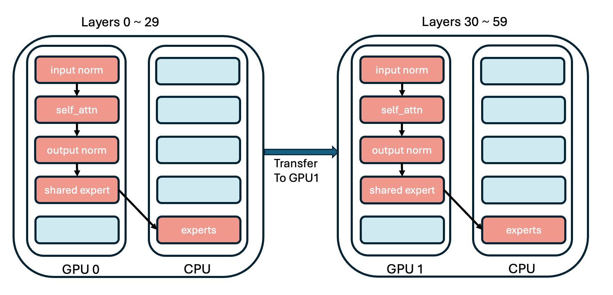

# 教程：算子注入步骤详解

> 作者：Azure-Tang

## 简介
本教程将指导您使用KTransformers框架向模型注入自定义算子的过程。我们将以DeepSeekV2-Chat模型为例，演示如何逐步向模型注入自定义算子。本教程将涵盖以下主题：
* [如何编写注入规则](#如何编写注入规则)
    * [理解模型结构](#理解模型结构)
* [多GPU支持](#多gpu支持)    
* [如何编写新算子并将其注入模型](#如何编写新算子并将其注入模型)

## 如何编写注入规则
Inject框架的注入规则基本形式如下：
```yaml
- match:
    name: "^model\\.layers\\..*\\.*$"  # 目标模块名称
    class: torch.nn.Linear  # 目标模块
  replace:
    class: "default"
    kwargs:
      generate_device: "cuda:0"
      # your_op_param_1: 1234
      # your_op_param_2: 5678
  recursive: True
```
* match: 这个字段标记匹配规则，可以以两种形式出现，name和class。这两种匹配规则可以一起出现或单独出现；只有在两个条件都满足时才会匹配。
* replace:
	* class: 可以导入的Python类，用于替换目标模块。如果不需要替换，设置为default。
	* kwargs: 模块初始化所需的参数列表。
	    * generate_device: 该模块的设备，可以设置为"cpu"、"cuda"、"cuda:1"等。
* recursive: 是否递归注入此模块的子模块，默认为True。

关于recursive字段：一些模块包含多个子模块，例如Self-attention模块通常包括q/k/v/o四个线性模块。如果我们替换self-attention模块但不希望内部线性模块被其他规则覆盖，则将此规则设置为False。

## 理解模型结构
以[deepseek-ai/DeepSeek-V2-Lite-Chat](https://huggingface.co/deepseek-ai/DeepSeek-V2-Lite-Chat)为例，我们可以按照上述规则逐步注入自定义模块并运行它。KTransformers提供了高度的灵活性，允许您替换/实验基本算子。但这也要求用户清楚地了解他们正在运行的模型结构。

幸运的是，了解模型的结构非常简单。打开[deepseek-ai/DeepSeek-V2-Lite](https://huggingface.co/deepseek-ai/DeepSeek-V2-Lite-Chat/tree/main)主页上的文件列表，您可以看到以下文件：
<p align="center">
  <picture>
    
  </picture>
</p>

从`.saftensors`文件中，我们可以看到每个层的权重名称，对应于注入规则中的match.name属性。
从`modeling_deepseek.py`文件中，我们可以看到每个模块类的具体实现，类名对应于注入规则中的match.class属性。

从`.saftensors`和`modeling_deepseek.py`文件中得到的DeepSeekV2模型的结构如下：
<p align="center">
  <picture>
    
  </picture>
</p>

支持的算子及其对应的类如下：

| match     | replace                | backends                | descriptions         |
| --------- | ---------------------- | ----------------------- | -------------------- |
| Linear    | KTransformersLinear    | KLinearMarlin           | 使用Marlin作为后端    |
|           |                        | KLinearTorch            | 使用pytorch作为后端   |
|           |                        | KLinearCPUInfer         | 使用llamafile作为后端 |
|           |                        | KLinearFP8         | Triton fp8_gemm内核。要求GPU能够计算fp8数据 |
| experts   | KTransformersExperts   | KExpertsTorch           | 使用pytorch作为后端   |
|           |                        | KExpertsMarlin          | 使用Marlin作为后端    |
|           |                        | KExpertsCPU             | 使用llamafile作为后端 |
| Attention | KDeepseekV2Attention   | KDeepseekV2Attention    | MLA实现              |
| MoE       | KMistralSparseMoEBlock | KQwen2MoeSparseMoeBlock | Qwen2的MoE实现       |
|           | KDeepseekV2MoE         | KDeepseekV2MoE          | DeepseekV2的MoE实现  |
| Model     | KQwen2MoeModel         | KQwen2MoeModel          | Qwen2的模型实现      |
|           | KDeepseekV2Model       | KDeepseekV2Model        | DeepseekV2的模型实现 |
| RoPE      | RotaryEmbedding        | RotaryEmbedding         | RoPE模块             |
|           | YarnRotaryEmbedding    | YarnRotaryEmbedding     | RoPE模块             |

然后我们开始逐步注入自定义模块，我们的目标是：

* 用自定义Marlin线性模块替换线性模块。
* 用基于吸收的自定义MLA模块替换self-attention模块。
* 用自定义Experts模块替换experts模块。
* 用自定义MoE模块替换MoE模块。
* 用自定义RoPE模块替换RoPE模块。
* 为每个模块设置运行设备。

注入规则的完整实现可以在[这里](https://github.com/kvcache-ai/ktransformers/blob/main/ktransformers/optimize/optimize_rules/DeepSeek-V2-Chat.yaml)找到。

## 基于矩阵吸收的MLA注入

对于Attention模块的注入，我们只需使用正则表达式匹配transformers中使用的模块名称，并用我们自己的MLA模块实现来替换它们。YAML注入规则如下：
```yaml
- match:
    name: "^model\\.layers\\..*\\.self_attn$"  # 正则表达式
  replace:
    class: ktransformers.operators.attention.KDeepseekV2Attention # 优化的MLA实现
```
如您所见，YAML文件中的每条规则都有两个部分：match和replace。match部分指定要替换的模块，replace部分指定要注入模型的模块及其初始化关键字。

## 路由专家的注入
对于路由专家（对应图中的exps），我们注入的模块是CPUInfer，它被包装在KTransformersExperts包装模块中。KTransformersExperts有多种实现，我们需要指定关键字来告诉包装模块我们想要使用哪种实现以及我们计划如何使用它。

在transformer的源代码中，MoE是使用nn.ModuleList实现的。我们不希望KTransformers遍历列表中的所有子模块并逐个注入，因此在这个规则中，我们设置recursive: False以防止递归注入此模块的子模块。YAML规则如下：

```yaml
- match:
    name: "^model\\.layers\\..*\\.mlp\\.experts$"
  replace:
    class: ktransformers.operators.experts.KTransformersExperts     # 具有专家并行性的自定义MoE内核
    kwargs:
      generate_device: "cpu"
      generate_op: "MLPCPUExperts"
      out_device: "cuda"
  recursive: False # 不递归注入此模块的子模块
```

如果我们将路由专家注入为自定义模块，则无法使用原始`nn.ModuleList`中的接口。因此，有必要修改FFN模块中的forward函数。最简单的方法是实现一个具有自定义forward函数的新模块并注入它。
```yaml
- match:
    class: ktransformers.models.modeling_deepseek.DeepseekV2MoE
  replace:
    class: ktransformers.operators.experts.KDeepseekV2MoE     # 具有自定义forward函数的MLP模块
```

## 线性层的注入

对于剩余的线性层模块，我们的目标是使用量化算子来节省存储空间并提高性能。由于目前没有关于将MLA和量化一起使用的研究，我们不希望将线性注入到MLA算子中。因此，我们可以修改正则表达式并在规则的match部分添加类型检查。只有同时匹配名称和类的模块才会被注入。我们还需要传递一些类似于路由专家注入的关键字。YAML规则如下：

```yaml
- match:
    name: "^model\\.layers\\.(?!.*self_attn).*$"  # 正则表达式
    class: torch.nn.Linear  # 仅匹配同时符合名称和类的模块
  replace:
    class: ktransformers.operators.linear.KTransformersLinear  # 量化数据类型的优化内核
    kwargs:
      generate_device: "cuda"
      generate_op: "QuantizedLinearMarlin"
```
## 预计算缓冲区模块的注入

为了避免在初始化注入的原始模型时占用资源，我们使用torch的meta设备来初始化原始模型。RoPE模块在初始化期间预计算一些缓冲区，但使用meta设备时不执行计算。因此，我们需要在加载模型时补偿缓冲区的计算。简单来说，我们将自定义模块注入到旋转嵌入模块中，该模块在加载期间执行预计算。YAML规则如下：
```yaml
- match:
    class: ktransformers.models.modeling_deepseek.DeepseekV2YarnRotaryEmbedding
  replace:
    class: ktransformers.operators.RoPE.YarnRotaryEmbedding
```

## 为模块指定运行设备

最后，我们为所有模块设置一个基本的generate_device属性：
```yaml
- match:
    name: "^model\\.layers\\..*\\.|^lm_head"
  replace:
    class: "default"
    kwargs:
      generate_device: "cuda"
  
- match:
    name: "^model.embed_tokens"
  replace:
    class: "default"
    kwargs:
        generate_device: "cpu"
```
通过这两条规则，我们将所有先前未匹配的层（及其子模块）和lm_head放在cuda上，将嵌入放在cpu上。请注意，模块的属性将由它匹配的第一条规则决定。例如，如果您稍后在注入的模块中设置新的replace.kwargs.generate_device，则较早设置的设备将优先。如果您的计算机有多个显卡，您也可以将模型配置为多个显卡。


## 多GPU支持

如果您有多个GPU，您可以为每个模块设置不同的GPU设备。 
DeepseekV2-Chat有60层，如果我们有2个GPU，我们可以将30层分配给每个GPU。完整的多GPU规则示例[在这里](https://github.com/kvcache-ai/ktransformers/blob/main/ktransformers/optimize/optimize_rules/DeepSeek-V2-Chat-multi-gpu.yaml)。


<p align="center">
  <picture>
    
  </picture>
</p>

首先，对于多GPU，我们必须注入一个新的算子`KDeepseekV2Model`，并设置层的分配到不同的GPU。在我们的例子中，我们必须在`KDeepseekV2Model`算子中设置`transfer_map`，如下所示：

```yaml
- match:
    name: "^model$"
  replace:
    class: "ktransformers.operators.models.KDeepseekV2Model"
    kwargs:
      transfer_map: 
        30: "cuda:1"
```

而且我们必须为模型中的每个模块设置设备。

例如，对于`routed experts`，单GPU的yaml是：
```yaml
- match:
    name: "^model\\.layers\\..*\\.mlp\\.experts$"
  replace:
    class: ktransformers.operators.experts.KTransformersExperts     # 具有专家并行性的自定义MoE内核
    kwargs:
      generate_device: "cuda:0"
      generate_op: "MLPCUDAExperts"
      out_device: "cuda:0"
  recursive: False # 不递归注入此模块的子模块
```
但对于两个GPU，我们需要为模型中的每个模块设置设备。

```yaml
# 将0-29层的out_device设置为cuda:0
- match:
    name: "^model\\.layers\\.(0|[1-9]|[12][0-9])\\.mlp\\.experts$"
  replace:
    class: ktransformers.operators.experts.KTransformersExperts     # 具有专家并行性的自定义MoE内核
    kwargs:
      generate_device: "cpu"
      generate_op:  "KExpertsCPU"
      out_device: "cuda:0"
  recursive: False # 不递归注入此模块的子模块

# 将30-59层的out_device设置为cuda:1
- match:
    name: "^model\\.layers\\.([345][0-9])\\.mlp\\.experts$"
  replace:
    class: ktransformers.operators.experts.KTransformersExperts     # 具有专家并行性的自定义MoE内核
    kwargs:
      generate_device: "cpu"
      generate_op:  "KExpertsCPU"
      out_device: "cuda:1"
  recursive: False # 不递归注入此模块的子模块
```
对于其他模块，我们可以以相同的方式设置设备。

## 如何编写新算子并将其注入模型

在本节中，我们将解释如何编写可注入的算子，以新线性的实现为例。

首先，所有可注入的算子都需要继承BaseInjectedModule类，它继承了我们注入框架所需的一些属性。其初始化函数需要符合以下基本格式：

```python
class LinearTorchInject(BaseInjectedModule):
    def __init__(
        self,
        key: str,
        gguf_loader: GGUFLoader,
        config: PretrainedConfig,
        orig_module: nn.Module = None,
        generate_device: str = "cuda",
        **kwargs,
    ):
        super().__init__(key, gguf_loader, config, orig_module, generate_device, **kwargs)
```
如果用户有其他需要传递给此类的参数，也可以包含在init函数中，并在yaml文件中的kwargs参数中重新传递。例如，如果我们的算子想要传递一个参数`my_param`，init函数可以写成：
```python
class LinearTorchInject(BaseInjectedModule):
    def __init__(
        self,
        key: str,
        gguf_loader: GGUFLoader,
        config: PretrainedConfig,
        orig_module: nn.Module = None,
        generate_device: str = "cuda",
        my_param: bool = True,
        **kwargs,
    ):
        super().__init__(key, gguf_loader, config, orig_module, generate_device, **kwargs)
        self.my_param = my_param
```
然后我们的注入规则可以写成：
```yaml
- match: 
    name: "^model\\.layers\\..*$"  # 正则表达式匹配模块名称。
    class: torch.nn.Linear  # 可以添加类型限制。
  replace:
    class: ktransformers.operators.linear.LinearTorchInject  # 注入模块路径
    kwargs: # 额外参数
      generate_device: "cuda"
      my_param: True
```
对于线性模块，还需要从gguf文件中读取权重。我们提供了`KLinearBase`类来帮助用户从gguf文件中读取权重。用户只需继承并实现load、unload和forward函数。因此，一个完整的可注入线性类将如下所示：
```python
class LinearTorchInject(BaseInjectedModule, KLinearBase):
    def __init__(
        self,
        key: str,
        gguf_loader: GGUFLoader,
        config: PretrainedConfig,
        orig_module: nn.Module = None,
        generate_device: str = "cuda",
        **kwargs,
    ):
        super().__init__(key, gguf_loader, config, orig_module, generate_device, **kwargs)
        KLinearBase.__init__(self)
        self.has_bias = False
        self.dtype = torch.get_default_dtype()
        self.w = None
        self.has_bias = False
    
    def load(self, w: dict | nn.Parameter | tuple | None = None, device: str|None = None):
        if device is None: device = self.device
        if w is None: w = self.load_weight(device=device)

        if isinstance(w, nn.Parameter):
            self.w = w.to(dtype=self.dtype).view(self.out_features, self.in_features).T
            self.has_bias = False
        elif isinstance(w, tuple):
            self.w = w[0].to(dtype=self.dtype).view(self.out_features, self.in_features).T
            self.bias = w[1].to(dtype=self.dtype)
            self.has_bias = True
        else:
            raise ValueError("Invalid weight type")
        self.w = self.w.to(device)
        if self.has_bias:
            self.bias = self.bias.to(device)

    def unload(self):
        if self.w is not None:
            self.w = None
        if self.has_bias:
            self.bias = None

    def forward(self, x: torch.Tensor) -> torch.Tensor:
        dtype = x.dtype
        out_device = x.device
        x = x.to(device=self.device, dtype=self.dtype)
        x = x @ self.w
        if self.has_bias:
            x = x + self.bias
        x = x.to(dtype=dtype, device=out_device)
        return x
```
请注意，`self.load_weight`函数由KLinearBase类提供，以帮助用户将权重从gguf文件加载到模块中。KLinearBase的实现细节可以在[GITHUB](https://github.com/kvcache-ai/ktransformers/blob/44f57270c9514d79fab224186d90ccf61059331a/ktransformers/operators/linear.py#L31)上找到。 