# KVCache 长上下文

## 摘要

训练更大的模型和支持更长的文本序列是目前业界公认的两个通向AGI的方向。在降低了万亿参数MoE模型本地推理门槛后，KTransformers的第二个展示场景是降低超长上下文序列的推理门槛。最近，ChatGLM和InternLM都发布了支持1M token上下文的开源模型。本文将以InternLM2.5-7B-Chat-1M为例，介绍一种利用注意力机制稀疏性，在异构CPU/GPU系统上加速长文本推理的方法。

经过优化，KTransformers在单个24GB GPU配合CPU/DRAM的支持下，成功实现了128K甚至1M token上下文的原生精度推理。在128K上下文场景下，生成速度比llama.cpp快7.1倍，同时在相对简单的测试集如"针中寻草"和"密钥"上取得了100%的准确率。在更具挑战性的kvretrieval数据集上，通过灵活的框架配置，我们在推理时实现了**6.22倍的加速**，同时获得比直接运行原始模型更高的分数(**21.0 -> 24.4**)。在单个24GB GPU上的1M上下文场景中，KTransformers同样可以实现16 tokens/s的推理速度，比相同条件下的llama.cpp快近10倍，且在"针中寻草"评估分数上甚至超过原始模型(**89.31 -> 92.88**)。

项目地址：https://github.com/kvcache-ai/ktransformers

## 数学原理：长文本推理的计算开销和Softmax导致的Attention稀疏性

随着对更长上下文窗口需求的增加，不仅商业大模型如Kimi和Claude/Gemini开始支持越来越长的上下文窗口，开源模型也开始跟进。值得注意的是，ChatGLM 4和InternLM 2.5都发布了参数量低于100亿但支持高达100万token上下文的版本。然而，尽管这些模型的参数量相对较小，但如此超长上下文所需的巨大KVCache仍然阻碍了本地用户实际运行这些模型。如下图所示，虽然InternLM2.5-7B-Chat-1M模型权重仅需15.49GB GPU内存，但还需要额外145.49GB来存储整个1M token的KVCache，这显然超出了本地用户的内存容量。即使使用llama.cpp的KVCache Offload功能将KVCache卸载到CPU/DRAM上，勉强使模型可运行，但由于每生成一个token都需要完整扫描整个KVCache，性能仍然无法接受。

| 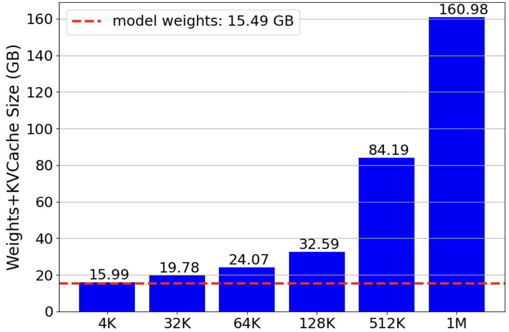 | 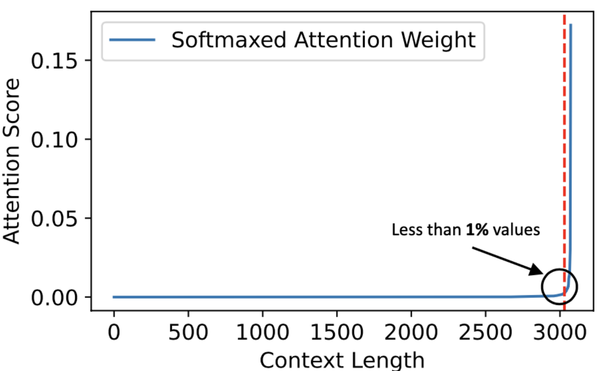 |
| ------------------------------------------------------------------------------------ | -------------------------------------------------------------------------- |

幸运的是，许多研究注意到推理阶段的注意力分布往往是**稀疏的**。例如，右图显示了SparQ基于LLaMa 7B的实验统计，其中在3k上下文中，不到1%的token具有相对较高的注意力分数。类似的结论不仅在H2O、Quest、InfLLM、SnapKV等许多其他论文中得到反映，我们还通过InternLM 2.5-7B-1M的长文本实验进一步验证了这一点。虽然比例并不像1%那么极端，但由于attention机制中softmax操作固有的头部聚焦效应，理论上如果我们能够提前确定哪些token具有高注意力分数，扫描不到5%的token就足以基本复制原始结果。

因此，问题缩小为如何在不全部扫描的情况下快速识别这些具有高注意力分数的token。在接下来的部分，我们将首先简要介绍几篇关键的相关论文，然后总结并提出我们在KTransformers中设计和实现的通用框架—一个针对CPU的高效稀疏注意力算子。

## 相关论文和结论

### 剪枝还是检索？

基于上述观点，我们研究了近年来与KVCache中稀疏选择相关的论文。其中最早的是H2O论文，它提出推理过程中的注意力分布是稀疏的，推理时只需要5%的KVCache。此后，一系列工作基于H2O的方法，设计了更复杂的token选择方法，在不同场景下表现更好。这些方法对单词推理相当合理。然而，正如我们之前在Mooncake项目中探索的那样，**我们认为未来的趋势是尽可能预先计算可重用的KVCache，然后使用它来回答不同的问题。**这种"计算一次，多次使用"的方法旨在减少计算成本。因此，考虑到这一目标，我们倾向于不删除KVCache中的任何token，或者至少不删除其中的大部分，以确保未来不同的问题可以关注上下文的不同部分。

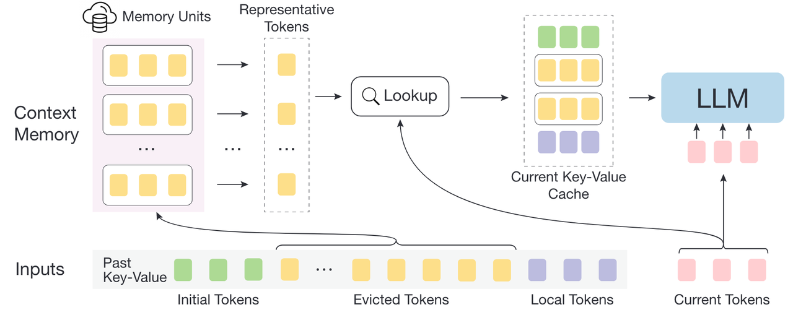

我们进一步调查了相关研究，其中InfLLM提出了一个非常有前景的框架。它不仅认识到注意力是稀疏的，还表明过长的上下文会导致注意力分散到无关的噪声中，从而降低模型关注关键信息的能力。为解决这个问题，InfLLM引入了一个外部内存模块(Memory Units)来存储上下文的KVCache。在每个计算步骤中，从这个外部内存模块中检索最相关的语义信息参与计算，从而增强模型处理长上下文推理的能力。

具体来说，InfLLM使用由相邻token组成的语义块组织外部内存模块，并在计算过程中使用滑动窗口机制。在每个步骤中，它只选择上下文开头的语义块(Initial Tokens)、靠近当前token的块(Local Tokens)以及与当前token具有最高语义相似度的少数块参与注意力计算。如等式1所示，为了高效检索具有最高相似度的块，InfLLM在每个块内选择一些得分$$r_m$$最高的代表性token。使用等式2计算当前token与每个语义块之间的语义相似度。

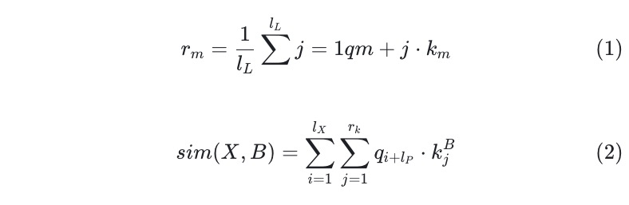

与前面提到的H2O相比，InfLLM的区别如下：

1. KVCache不被丢弃，而是存储在内存中，并在推理过程中动态加载到GPU上。

2. KVCache以块为单位而非以token为单位进行管理，每个块选择几个token作为其代表性索引token。

InfLLM提出的方法与我们"计算一次，多次使用"的KVCache重用方法一致。这种方法中的外部内存单元可以卸载到CPU/DRAM甚至SSD存储中，根据特定问题选择不同部分进行计算。这显著提高了注意力计算的效率。

### 其他改进

同样，在InfLLM之后，Quest也以块为粒度管理token。Quest分析了H2O和完整注意力中关键token的召回率，发现H2O算法的Top-10注意力分数token召回率约为50%，这表明太多关键信息被丢失。为提高关键token的召回率，Quest从每个块中选择两个"代表性token"进行检索。在预填充阶段，每个KVCache块记录每个通道的最大值和最小值，如下图中的"Reduced Keys"所示，其中包含元素级最小键和元素级最大键。

在注意力计算阶段，计算当前查询向量与每个KVCache块的最大键和最小键之间的点积。然后，对于每个通道，选择两个结果乘积向量之间的最大值，并将其相加作为该KVCache块的相关性分数上限，如图中的第1阶段所示。根据相关性分数，选择前k个KVCache块参与注意力计算，如图中的第2阶段所示。

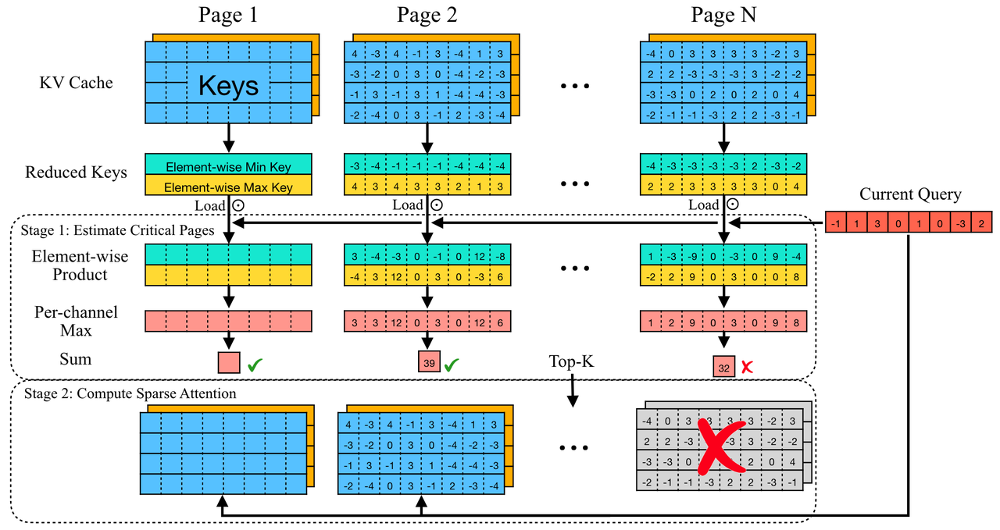

与InfLLM相比，Quest没有考虑异构架构。相反，它假设所有KVCache仍然可以放入内存，仅利用稀疏注意力来加速推理过程。最终，Quest在注意力计算上实现了7.03倍的加速，在端到端推理延迟上实现了2.23倍的改进。

更进一步，SnapKV提出在预填充阶段保留两部分token，如下图中的橙色和绿色部分所示。与InfLLM的区别仅在于选择中间token的方法。SnapKV在token级别而非块级别选择token，分数计算与H2O类似，即$$softmax(\frac{qk^T}{\sqrt{d_k}})$$。然而，在对列进行求和时，只选择最终绿色窗口内的行进行计算，对应于InfLLM中的Local Tokens部分。此外，SnapKV在注意力之上引入了池化操作，论文解释这是为了确保召回的token保留更完整的语义信息。

SnapKV的这种方法在推理阶段进行一次性选择，之后只使用选定的token进行注意力计算，而丢弃其余的KVCache。

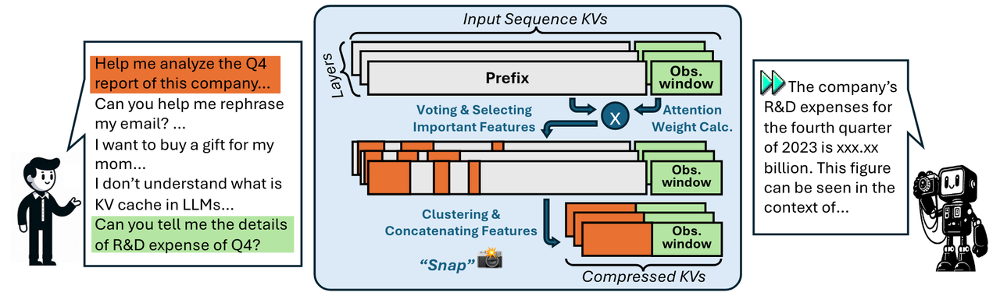

其他相关论文包括PyramidKV，它观察到注意力分数在注意力层之间呈现金字塔形分布。在较低的注意力层中，注意力广泛分布，而在较高层中，少数关键token的注意力分数变得越来越突出。因此，PyramidKV在较低层分配更多的KVCache存储空间，在较高层分配更少的空间。

MagicPiG基于局部敏感哈希(LSH)，提出了一种动态KVCache管理策略。首先，它使用SnapKV选择一部分重要token存储在GPU中，而其他token的KVCache放置在内存中。通过利用LSH在高维空间搜索的高效性和CPU的多线程能力，MagicPiG从内存中检索与当前查询类似的KVCache，并将其加载到内存中进行推理。与前面的方法如InfLLM、Quest和SnapKV相比，MagicPiG不需要扫描所有代表性token并选择前k个KVCache。相反，它利用LSH的数学特性，不仅模拟注意力分数，还以低开销和高速度识别重要的KVCache。

以上只是对一些关键点的描述。更详细的解释，可以参考知乎上现有的中文文章：

- https://zhuanlan.zhihu.com/p/701580870

- https://zhuanlan.zhihu.com/p/714288577

## KTransformers CPU稀疏注意力框架

### 框架原型

基于上述论文的介绍，我们总结了以下几个关键点：

- 注意力权重的分布是稀疏的，无用的KVCache可能引入噪声，实际上可能会降低推理阶段的性能。

- 对于推理阶段的KVCache淘汰策略，常见的方法是保留提示开头和结尾的token，同时设计算法来选择中间部分的token。影响模型性能的主要因素之一是准确识别关键token的能力。

- 以块为单位管理中间部分的token可以提高内存交换和注意力计算效率，较小的块似乎不会比token级粒度表现更差。

- 推理过程中各注意力层关注的token不同，甚至不同层分配的KVCache容量也应该有所不同。

基于这些见解和启发，我们开发了一个通用框架，用于在推理阶段实现稀疏CPU注意力算子。在预填充阶段，我们使用分块预填充，每次只将一层的KVCache加载到GPU内存中进行计算。完成后，KVCache存储在CPU/DRAM上。在随后的解码阶段，不是来回交换KVCache，而是直接在CPU上运行稀疏注意力算子。**这显著降低了最低GPU内存要求，使本地128K甚至1M token上下文成为可能。**

具体在生成阶段，我们实现的整个框架如下图所示。

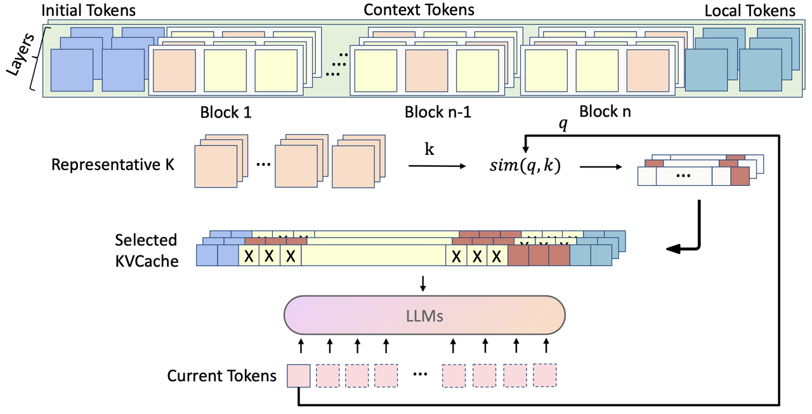

我们以块为单位组织KVCache。具体来说：

- **KVCache分区：** 完整的输入提示被划分为三个可配置部分：Initial、Context和Local。在计算过程中，Initial/Local部分将被完全关注，而Context部分将被稀疏检索。这种方法基于许多论文（如streamingLLM和Minference）提到的"注意力沉降"现象，即序列开头和结尾往往具有更高的注意力权重。

- **Context块分区：** 对于中间的Context，我们遵循InfLLM的方法，根据可配置的固定token数将其划分为块。每个块可以选择1到k个token作为其代表性token。在实际推理阶段，基于这些代表性token选择需要关注的Context块。
  
  - 具体来说，我们实现了以下选择代表性token的方法，基于各种论文中概述的方法。
    
    - Max：块内多个token在每个通道的最大值，连接形成当前块的代表性token。
    
    - Mean：块内多个token在每个通道的平均值，连接形成当前块的代表性token。
    
    - Quest：前两种方法的组合：块内多个token在每个通道的最大值和最小值，作为块的代表性token。在这种方法下，代表性token的数量固定为2。
    
    - Dynamic：通过使用特定方法计算每个token的累积注意力分数，每个块选择具有最高分数的top-k个token作为块的代表性token。这类似于InfLLM但有一些简化。
    
    - Fix：在块内以固定间隔选择token。
  
  - 一旦确定了每个块的代表性token，使用InfLLM的等式2计算输入X与每个块B的k个代表性token之间的相似度，并仅选择前r_k个块进行注意力计算，其中l_P表示历史token的长度：

由于InfLLM需要在预填充阶段计算每个token的代表性分数，然后根据这些分数为每个块选择代表性token，这种操作涉及对预填充实现的侵入式修改，使其难以与其他方法集成。此外，在实际测试中，我们发现在大多数场景下，通过其他方法的组合可以达到类似甚至更好的结果。因此，我们最终决定不将此方法集成到框架中。

## 进一步优化

实现上述框架后，我们基于LongBench和InfiniteBench进行了一系列评估。

在实验开始时，我们设计的架构是为每个推理token重新选择最相关的KVCache块。一方面，这种策略在检索过程中带来了显著的开销。另一方面，我们发现在某些场景下，**频繁更改检索块的选择并不会带来更好的结果**。例如，在kvretrieval数据集中，我们观察到模型的回答在前半部分通常是正确的，但在后半部分不正确。由于kvretrieval问题的答案由长而无意义的字符串组成，这表明在推理早期token时选择了正确的KVCache块，但在推理后期阶段选择了错误的块。

为解决这个问题，我们进一步整合了SnapKV提出的方法。在开始推理之前，我们通过分析上下文token的注意力分数，基于问题预先选择相关的KVCache块。在随后的推理阶段，KVCache块的选择被限制在这个预选范围内。这种方法使我们能够在kvretrieval数据集中100%地选择包含正确答案的块。

然而，应该注意的是，这种方法严格依赖于Benchmark Prompt的结构，**并不一定保证在其他场景中（如复杂文档理解和生成任务）具有最佳性能**。因此，我们将其作为可选模块集成到我们的框架中。最终框架和可配置参数如下：

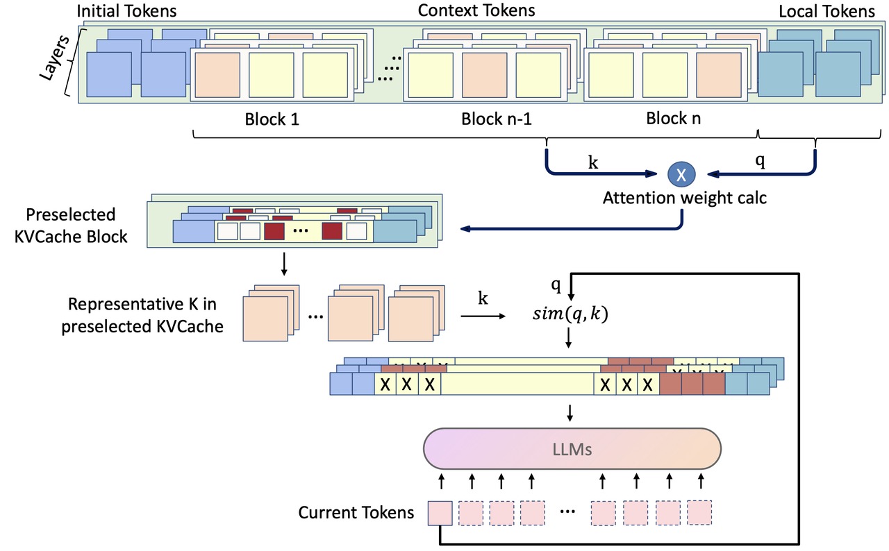

配置：

- **threads_num:** CPU线程数

- **block_size:** KVCache块大小

- **local_windows_len:** 提示结束窗口大小

- **preselect_block_count:** 预选块数量

- **second_block_count:** 预选后选择的块数量

- **preselect_block:** 是否启用预选

- **token_step:** KVCache的token选择间隔

- **layer_step:** KVCache的层选择间隔

- **dense_layer_num:** 无需KVCache选择的初始层数，导入所有KVCache

- **head_select_mode:SEPARATE**(在GQA场景中，每个kv_head单独选择) / **SHARED:** (所有kv_head一起选择)

- **representative_type:** 选择代表性token的方法

- **representative_num:** 代表性token的数量

通过修改配置选项，可以在我们的框架内轻松复现各种KVCache淘汰或压缩方法。例如：

- 将`block_size`设为1，`preselect_block`设为True，得到的是没有池化操作的SnapKV版本。

- 将`representative_type`设为Quest，`preselect_block`设为False，`head_select_mode`设为SEPARATE，复现Quest方法。

以下是该框架的伪代码：

```python
def preselect_block(local_q, kvcache):
    key_states = kvcache.keycache
    attn_scores = torch.matmul(
                local_q, key_states.transpose(2, 3)
            ) / math.sqrt(head_dim)
    attn_scores += attn_mask
    attn_scores = nn.functional.softmax(
                attn_scores, dim=-1, dtype=torch.float32
            ).to(query_states.dtype)
    vote = attn_scores[..., initial_size:-local_size:, :].sum(dim=-2)
    pool_vote = pool1d(vote, kernel_size=kernel_size, padding=kernel_size//2, stride=1)
    indices = pool_vote.topk(max_capacity_prompt - local_size, dim=-1).indices
    kv_cache_block_indices = find_representative_tokens_block(indices)
    kvcache_after_preselected = kvcache[kv_cache_block_indices]
    ...
    return kvcache_after_preselected
def get_representative_tokens():
    根据representative_type计算每个块的代表性token。
    return ...
def decode_attention(query, key, value):
  # 每token_steps个token选择一次。
  token_steps = 4
  # 每layer_steps层选择一次。
  layer_steps = 4
  for token_idx in range(max_new_tokens):
      for layer_idx in range(config.num_hidden_layers):
          if token_idx % token_steps != 0 or layer_idx % layer_steps != 0:
            # 如果当前轮次的当前层注意力不需要重新选择，将保留kvcache中的历史选择结果。
            kvcache_after_retrieval = history_kvcache_after_retrieval[layer_idx//layer_steps]
          else:
            # 否则，使用当前轮次当前层的query重新选择kvcache。
            kvcache_after_retrieval = retrieval_kvcache(query, kvcache)
            # 将其保存到kvcache历史选择结果中。
            history_kvcache_after_retrieval[layer_idx//layer_steps] = kvcache_after_retrieval
          # 计算注意力
          output = attn(query, kvcache_after_retrieval)
          yield output

# 模型预填充，如果需要预选，仍需保存local_q。
local_q, KVCache = model.prefill(input_ids)
if preselect_block:
    # 预选轮次
    KVCache = preselect_block(local_q, kvcache)
# 找到每个块的代表性token。
block_representative_tokens = get_representative_tokens(
   kvcache,                      
   config.representative_type
)

# 模型生成
'''
'''
decode_attention(query, key, value)
'''
''' 

## 实验

在测试开始时，我们将使用以下基本配置，然后通过扩展框架进一步优化。

```python
max_seq_len: 256000 # KVCache长度
block_size: 128 # KVCache块大小
local_windows_len: 4096 # 长度为local_windows_len的KVCache存储在GPU上。
second_block_count: 96 # 预选后每次选择的KVCache块数量。如果 >= preselect_block_count，则使用预选的块。
threads_num: 64 # CPU线程数
representative_type: DYNAMIC # KVCache块代表性token选择方法。
kv_type: FP16 
dense_layer_num: 0 # 前几层不需要填充或选择KVCache
representative_num: 1 # KVCache块内代表性token的数量。
preselect_block: False # 是否预选。
head_select_mode: SHARED # 所有kv_head联合选择。
preselect_block_count: 0 # 预选的块数量。
layer_step: 1 # 每隔几层选择一次。
token_step: 1 # 每隔几个token选择一次。
```

在我们的框架下，原始模型和加速后的KTransformers在128K Big Needle-in-a-Haystack、passkey、kvretrieval等数据集上的对比如下。passkey数据集涉及在冗余文本中不同深度插入一小段数字。kvretrieval是关于在随机生成的键值对中找到匹配项。所有测试均在opencompass框架下进行：

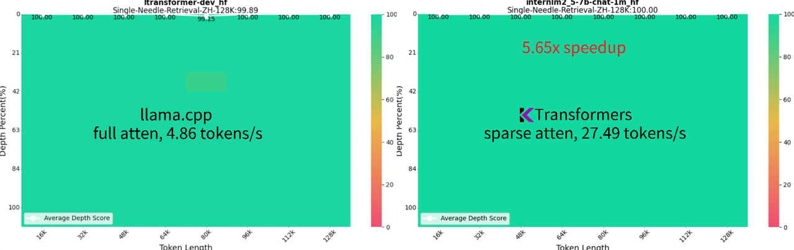

|                                            |                                 |         |             |
| -------------------------------------------| ------------------------------- | ------- | ----------- |
|                                            | Single needle retrieval zh 128k | passkey | kvretrieval |
| 原始模型                                    | 99.89                           | 100     | 21.0        |
| KTransformers (为每次生成重新选择KVCache块)  | 100                             | 100     | 15.40       |

我们可以看到，原始模型和加速后的KTransformers在相对简单的数据集（如Single Needle Retrieval和passkey）上都取得了完美分数。同时，生成速度显著提高，从llama.cpp的4.86 tokens/s提高到KTransformers的27.49 tokens/s，实现了高达5.65倍的加速。虽然当前配置在更具挑战性的kvretrieval数据集上显示出明显的性能下降，但在下一节中，我们将通过实现更优化的选择策略来弥补或甚至超越原始模型的准确性。

此外，我们测试了基于KTransformers的配置框架在复现Quest结果方面的表现。然而，由于InternLM2.5-7B-Chat-1M使用GQA（分组查询注意力），而Quest论文主要关注优化MHA（多头注意力）模型，实际测试结果并不特别有利。官方团队也提到需要进一步支持GQA模型，所以我们暂时不详细讨论这一点。

### 进一步提高性能

通过在灵活框架内修改某些配置，**我们实际上可以取得比之前论文报告的更好的结果，**如下图所示：

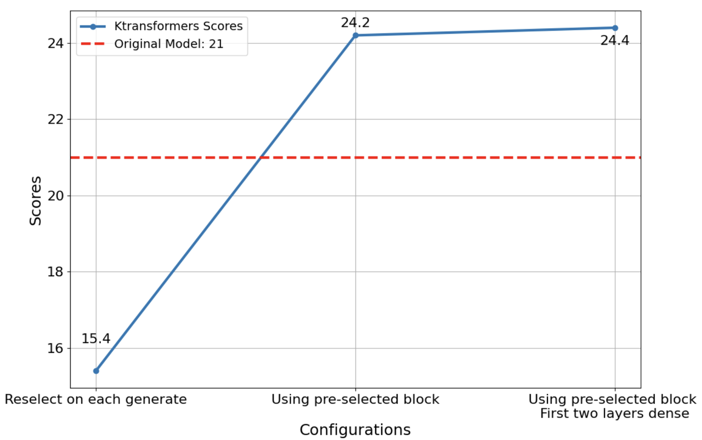

如前所述，kvretrieval数据集的目标是在一长串语义无意义的配对中找到匹配的键值对。如果每次根据当前查询重新选择生成token，随着文本增长，偏离的可能性增加，导致与之前选择相比选择不同的KVCache块。为解决这个问题，我们引入了使用SnapKV计算选择代表性token方法的预选机制，预先选择部分KVCache块。在随后的推理过程中，选择限制在这些块内。经过一轮预选，分数从15.4提高到24.2，**超过了原始模型+完整注意力的21分表现。**进一步研究表明，LLM前几层的KVCache稀疏效应不明显。因此，我们设置前两层完全重用KVCache，最终获得了**24.4分**。

同样，在1M数据集上测试needle-in-a-haystack任务时，我们不仅复现了原始模型报告的分数，还通过使用KTransformers CPU稀疏注意力框架选择性计算某些KVCache块，进一步提高了准确率（**从89.31提高到92.88**）。此外，推理速度**达到了llama.cpp的近10倍**。

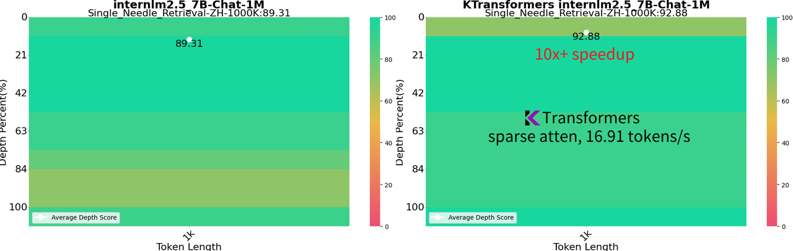

### 更多对比

如下面两图所示，以Single Needle Retrieval数据集为例，我们设置llama.cpp将KVCache存储在CPU/DRAM上，同时在GPU上执行所有计算。在4090D服务器上，我们将KTransformers CPU稀疏注意力框架与llama.cpp进行了对比。在保持**100%答案准确率**的同时，我们实现了20.6到94.1倍的预填充速度提升和**1.2到7.1倍的推理速度提升**。

| 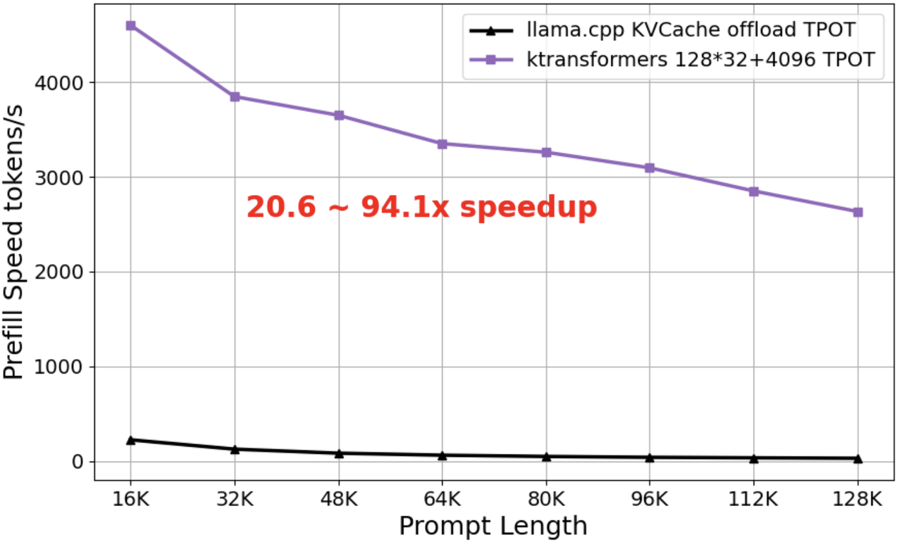 | 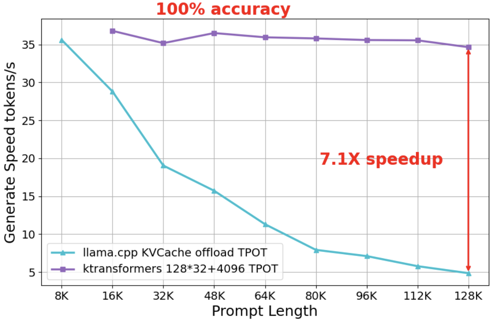 |
| --------------------------------------------------------------- | ----------------------------------------------------------------- |

预填充速度差距巨大的主要原因是，启用KVCache卸载后，llama.cpp在CPU上执行注意力(attn)计算。在长文本场景下，注意力不仅计算量大，还占据了大部分计算时间。相比之下，KTransformers利用灵活的模板注入框架实现了逐层的GPU分块预填充。展望未来，我们计划进一步整合高性能稀疏预填充方法（如MInference）以进一步提升速度。

此外，作为本文的重点，右图显示随着提示长度增加，KTransformers的推理速度保持稳定，接近水平线。相比之下，随着提示长度增加，llama.cpp速度变慢。通过只选择最重要的16K KVCache块参与推理计算，KTransformers在不降低性能的情况下（至少在这些测试数据集上），保持了与llama.cpp处理16K提示时相当的一致推理速度。

## 使用方法

目前，长上下文功能仅由我们的**local_chat.py**接口支持，与服务器接口的集成正在开发中。

为方便用户管理，我们已将模型配置、gguf和tokenizer上传到一个仓库。URL：https://huggingface.co/nilv234/internlm2_5_to_llama_1m/tree/main

通过将local_chat函数中的model_path和gguf_path设置为**/path/to/repo**，并将模式设置为**"long_context"**，您可以在24G VRAM上使用具有1m功能的InternLM2.5-7B-Chat-1M模型。

首次运行local_chat.py后，将在**~/.ktransformers**下自动创建一个config.yaml文件。长上下文的相关配置如下：

```python
chunk_size: 4096 # 预填充块大小
max_seq_len: 100000 # KVCache长度
block_size: 128 # KVCache块大小
local_windows_len: 4096 # 长度为local_windows_len的KVCache存储在GPU上。
second_select_num: 96 # 预选后每次选择的KVCache块数量。如果 >= preselect_block_count，则使用预选的块。
threads_num: 64 # CPU线程数
anchor_type: DYNAMIC # KVCache块代表性token选择方法。
kv_type: FP16
dense_layer_num: 0 # 前几层不需要填充或选择KVCache
anchor_num: 1 # KVCache块内代表性token的数量。
preselect_block: False # 是否预选。
head_select_mode: SHARED # 所有kv_heads联合选择。
preselect_block_count: 96 # 预选的块数量。
layer_step: 1 # 每隔几层选择一次。
token_step: 1 # 每隔几个token选择一次。
```

不同上下文长度所需的内存如下表所示：

|                | 4K  | 32K  | 64K  | 128K | 512K | 1M     |
| -------------- | --- | ---- | ---- | ---- | ---- | ------ |
| DRAM大小 (GB) | 0.5 | 4.29 | 8.58 | 17.1 | 68.7 | 145.49 |

请根据您的DRAM大小选择合适的max_seq_len。
例如：
```python
python local_chat.py --model_path="/data/model/internlm2_5_to_llama_1m"  --gguf_path="/data/model/internlm2_5_to_llama_1m" --max_new_tokens=500 --cpu_infer=10  --use_cuda_graph=True  --mode="long_context" --prompt_file="/path/to/file"
```

如果您已经通过prompt_file指定了输入文本，当终端显示chat:时，只需按Enter即可开始。 