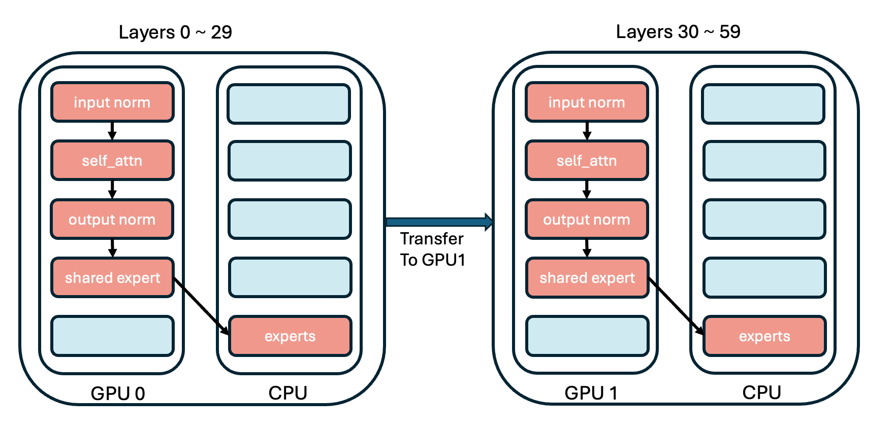

# 多GPU使用教程

假设您已经阅读了[算子注入教程](./injection_tutorial.md)并对如何注入模型有了基本的了解。在本教程中，我们将向您展示如何使用KTransformers在多个GPU上运行模型。

如果您有多个GPU，您可以为每个模块设置不同的GPU设备。
DeepseekV2-Chat有60层，如果我们有2个GPU，我们可以将30层分配给每个GPU。完整的多GPU规则示例可以在[这里](https://github.com/kvcache-ai/ktransformers/blob/main/ktransformers/optimize/optimize_rules/DeepSeek-V3-Chat-multi-gpu.yaml)找到。


<p align="center">
  <picture>
    
  </picture>
</p>

首先，对于多GPU，我们必须注入一个新的算子`KDeepseekV2Model`，并设置层的分配到不同的GPU。在我们的例子中，我们必须在`KDeepseekV2Model`算子中设置`transfer_map`，如下所示：

```yaml
- match:
    name: "^model$"
  replace:
    class: "ktransformers.operators.models.KDeepseekV2Model"
    kwargs:
      transfer_map: 
        30: "cuda:1"
```

而且我们必须为模型中的每个模块设置设备。

例如，对于`routed experts`，单GPU的yaml是：
```yaml
- match:
    name: "^model\\.layers\\..*\\.mlp\\.experts$"
  replace:
    class: ktransformers.operators.experts.KTransformersExperts     # 具有专家并行性的自定义MoE内核
    kwargs:
      generate_device: "cuda:0"
      generate_op: "MLPCUDAExperts"
      out_device: "cuda:0"
  recursive: False # 不递归注入此模块的子模块
```
但对于两个GPU，我们需要为模型中的每个模块设置设备。

```yaml
# 将0-29层的out_device设置为cuda:0
- match:
    name: "^model\\.layers\\.(0|[1-9]|[12][0-9])\\.mlp\\.experts$"
  replace:
    class: ktransformers.operators.experts.KTransformersExperts     # 具有专家并行性的自定义MoE内核
    kwargs:
      generate_device: "cpu"
      generate_op:  "KExpertsCPU"
      out_device: "cuda:0"
  recursive: False # 不递归注入此模块的子模块

# 将30-59层的out_device设置为cuda:1
- match:
    name: "^model\\.layers\\.([345][0-9])\\.mlp\\.experts$"
  replace:
    class: ktransformers.operators.experts.KTransformersExperts     # 具有专家并行性的自定义MoE内核
    kwargs:
      generate_device: "cpu"
      generate_op:  "KExpertsCPU"
      out_device: "cuda:1"
  recursive: False # 不递归注入此模块的子模块
```
对于其他模块，我们可以以相同的方式设置设备。

# 如何充分利用多GPU的VRAM

当您有多个GPU时，您可以通过将更多权重移动到GPU来充分利用每个GPU的VRAM。

例如，对于DeepSeekV2-Chat，我们可以将专家的权重移动到GPU。

例如，两个GPU的yaml是：
```yaml
- match:
    name: "^model\\.layers\\.(0|[1-9]|[12][0-9])\\.mlp\\.experts$"
  replace:
    class: ktransformers.operators.experts.KTransformersExperts
    kwargs:
      generate_device: "cpu"
      generate_op:  "KExpertsCPU"
      out_device: "cuda:0"
  recursive: False
```

但如果我们在cuda:0上有额外的60GB VRAM，我们可以将第4~8层的专家移动到cuda:0。

```yaml
# 在旧规则之前添加新规则
- match:
    name: "^model\\.layers\\.([4-8])\\.mlp\\.experts$" # 将第4~8层的专家注入为marlin专家
  replace:
    class: ktransformers.operators.experts.KTransformersExperts  
    kwargs:
      generate_device: "cuda:0"
      generate_op:  "KExpertsMarlin"
  recursive: False

- match:
    name: "^model\\.layers\\.(0|[1-9]|[12][0-9])\\.mlp\\.experts$"
  replace:
    class: ktransformers.operators.experts.KTransformersExperts     
    kwargs:
      generate_device: "cpu"
      generate_op:  "KExpertsCPU"
      out_device: "cuda:0"
  recursive: False 
```

根据需要调整层范围。请注意：
* 每个移动到GPU的专家都会明显降低加载速度。
* 如果要将专家移动到GPU，您必须关闭cuda graph。
* 对于DeepSeek-R1/V3，每个移动到GPU的专家将消耗约6GB的VRAM。
* 将应用yaml中第一个匹配的规则。例如，如果您有两个规则匹配同一层，只有第一个规则的替换才有效。 